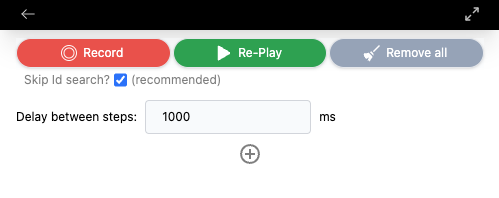
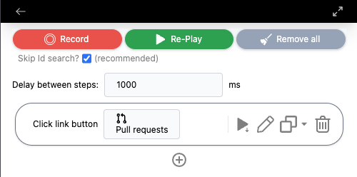
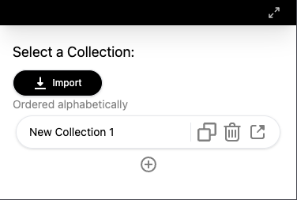

# Easy Web Macros

Google Chrome Extension that will allow an user to record your web actions and replay them with a **single click**.

## What can it do?

This extension can listen and record your user events from a web page and re-play them. Here are some quick demos about the extension: 

- English version demo

<iframe width="560" height="315" src="https://www.youtube.com/embed/98qy0xJYL1s?si=81RA0HDG0_0MZE9B" title="YouTube video player" frameborder="0" allow="accelerometer; autoplay; clipboard-write; encrypted-media; gyroscope; picture-in-picture; web-share" allowfullscreen></iframe>

- Spanish version demo

<iframe width="560" height="315" src="https://www.youtube.com/embed/98qy0xJYL1s?si=wpxK5LyUSqAH4dSZ" title="YouTube video player" frameborder="0" allow="accelerometer; autoplay; clipboard-write; encrypted-media; gyroscope; picture-in-picture; web-share" allowfullscreen></iframe>

> [!NOTE]
> The currently supported user events include:
> Clicking a button
> Clicking a link
> Writing text on a input

### Glossary

- **Collection**: A group of steps
- **Step**: A user event that was previously recorded or manually added by the user

## How to use it?

You'll see the following view when you open the extension for the first time:

- Record: This button will allow you to start recording your user **Steps** from a web page.
- Re-play: This button will allow you to re-play your **Steps** from the beginning.
- Remove all: This one is for removing all your steps if you want to begin a **Collection** from scratch

If you already have a **Step** recorded (or manually added), you'll see a view like the following:

On this view, you'll be able to:

- Play from a specific **Step**
- Edit any **Step**
- Duplicate a **Step** after or at the bottom
- Delete any **Step**

If you click the ← (arrow back) button, you'll see all of your **Collections** of **Steps**:

On this page, you will be able to:

- Rename your **Collections**
- Add a new **Collection**
- Remove any **Collection**
- Import/Export any **Collection**

## Tech stack

-   [Svelte](https://svelte.dev/)
-   [TypeScript](https://www.typescriptlang.org/)
-   [Vite](https://vitejs.dev/)
-   [CRXJS Vite Plugin](https://github.com/crxjs/chrome-extension-tools/blob/main/packages/vite-plugin/README.md)
-   [Chrome Extensions Manifest V3](https://developer.chrome.com/docs/extensions/mv3/intro/)

> [!IMPORTANT]
> This project was made using this [Svelte Chrome Extension Boilerplate](https://github.com/NekitCorp/chrome-extension-svelte-typescript-boilerplate)
